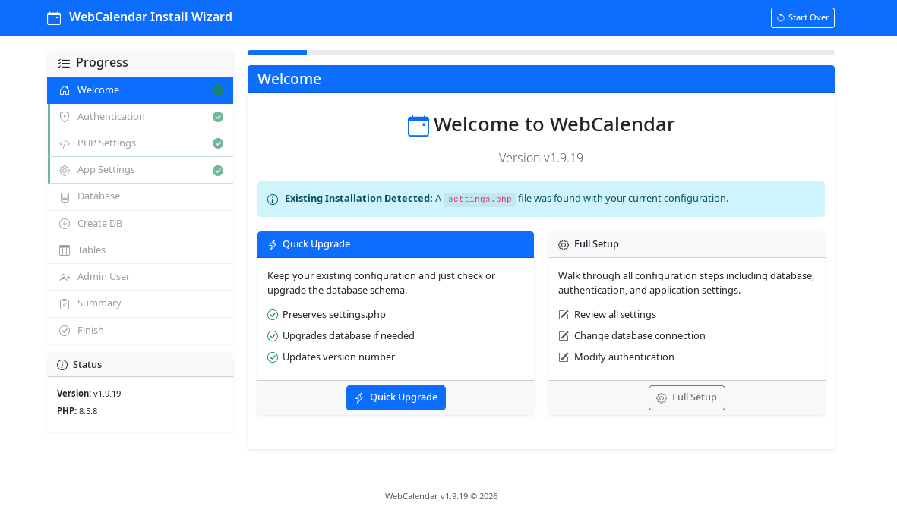
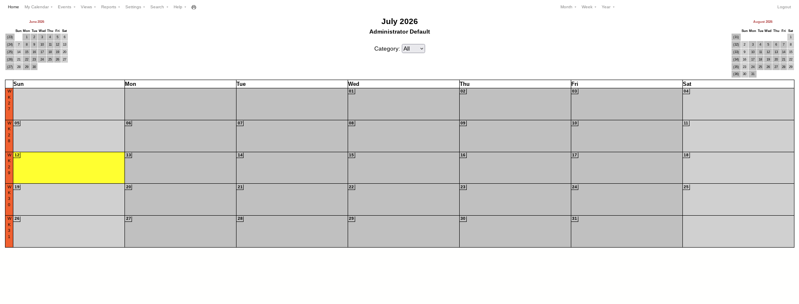

# WebCalendar Docker (SQLite, built from git)

[](https://github.com/MysterHawk/webcalendar-docker/actions/workflows/docker-publish.yml)

Unofficial Docker setup for [WebCalendar](https://github.com/craigk5n/webcalendar),
a self-hosted PHP calendar app. **Not affiliated with the upstream project.**

Upstream's own Docker setups (`docker/docker-compose-php8.yml` and
`docker/docker-compose-php8-dev.yml`) use MariaDB or PostgreSQL. This repo
swaps that for SQLite3, so there's no separate database container to
configure — good for a single-user or small-team install.

Clones WebCalendar directly from the official git repo at build time
(pinned to a tag via `WEBCALENDAR_REF`, defaulting to `v1.9.19`) instead of
using the release zip — this avoids a packaging gap in the `v1.9.19` zip
where `includes/mcp-loader.php` is referenced by `includes/init.php` but
wasn't actually included in the archive. The git tree has had this file
since `v1.9.14`, so cloning sidesteps the problem entirely.

Mirrors upstream's [`docker/Dockerfile-php8`](https://github.com/craigk5n/webcalendar/blob/master/docker/Dockerfile-php8)
approach (classic `includes/settings.php`-based install wizard).

## Screenshots:


**Setup page**


**View of the week**

(for more screenshots see [screenshot folder](./screenshots))

## Run it

**Option 1 — use the prebuilt image (fastest)**

A multi-arch image (amd64 + arm64) is built and published automatically
via GitHub Actions to GHCR. Grab the `docker-compose.yml` from this repo (it already points at the prebuilt
image) and run it:

```bash
curl -O https://raw.githubusercontent.com/MysterHawk/webcalendar-docker/main/docker-compose.yml
docker compose up -d
```

Or clone the repo and skip straight to up -d without --build:

```bash
git clone https://github.com/MysterHawk/webcalendar-docker.git
cd webcalendar-docker
docker compose up -d
```
Either way, Compose will pull `ghcr.io/mysterhawk/webcalendar-docker:latest`
instead of building it, and set up the bind-mounted `data/` and `includes/`
folders for you automatically.

Available tags: `latest` (tracks `main`), `X.Y.Z` / `X.Y` for tagged
releases, and `nightly` (weekly scheduled rebuild — picks up upstream
patches to the pinned git ref and base-image security updates). To pin a
specific tag instead of `latest`, edit the image: line in
`docker-compose.yml`. See the
[Packages page](https://github.com/MysterHawk/webcalendar-docker/pkgs/container/webcalendar-docker) for the full list.

**Option 2 — build it yourself**

```bash
docker compose up -d --build
```

Open **http://localhost:8080** — you'll land on WebCalendar's install
wizard.

- On the database step, choose **SQLite3**.
- For the database path, use `localhost` it basically uses the correct path in the background.
- Complete the remaining steps (install password, create tables, create
  the admin account).
- **Do not enable "single user mode" in the wizard.** There's an upstream
  bug where `single_user_login` isn't being picked up correctly, which
  causes an error right after install:
  ```
  Warning: Undefined array key "single_user_login" in /var/www/html/includes/config.php on line 335
  WebCalendar Error
  You must define single_user_login in ...
  ```

Your `.sqlite3` file and the generated `includes/settings.php` both live
in local bind-mounted folders (`./webcalendar-data` and
`./webcalendar-includes`), so they survive `docker compose down`,
container recreation, and image rebuilds.

## Change the port

Edit the `ports:` mapping in `docker-compose.yml` (left side is the host
port), e.g. `"80:80"` to serve directly on port 80.

## Building a different version

Change the `WEBCALENDAR_REF` build arg in `docker-compose.yml` to any git
tag or branch (e.g. `master` for the latest dev code, or another release
tag), then:

```bash
docker compose build --no-cache
docker compose up -d
```

Your data (in the two bind-mounted folders) is untouched by this since
it's never baked into the image.

## Back up your data

Just copy the bind-mounted folders directly, since they're plain
directories on your host:

```bash
tar czf webcalendar-backup.tar.gz ./webcalendar-data ./webcalendar-includes
```

## Notes

- SQLite3 (single file, no server) is a good fit for a single-user or
  small-team self-hosted setup. For larger multi-user deployments the
  project recommends MySQL/MariaDB or PostgreSQL instead — see upstream's
  own Docker Compose files for that.
- Email reminders and remote-calendar refresh rely on a cron job hitting
  `send_reminders.php` — not included here since it's a minor add-on; open
  an issue if you'd like that wired in too.
- No default admin credentials are baked into the image; you set the
  install password and admin account yourself during the wizard.
- Building from git means `composer`-managed vendor libraries (used only
  by the optional MCP/AI-assistant endpoint, not the core calendar) won't
  be present unless you add a `composer install` step — the core app
  doesn't need them.
- **Single user mode is currently broken upstream** — see the warning in
  the "Run it" section above. Use multi-user mode for now.

## License

WebCalendar itself is licensed under the
[GNU GPL v2.0](./LICENSE).
This repo's Dockerfile and Compose config are also GPL-2.0 to match.

## Credits

All calendar functionality is [WebCalendar](https://github.com/craigk5n/webcalendar)
by Craig Knudsen and contributors. This repo just packages it differently.
